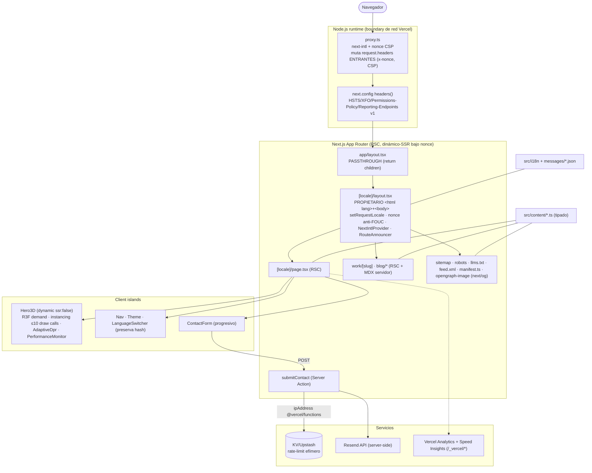
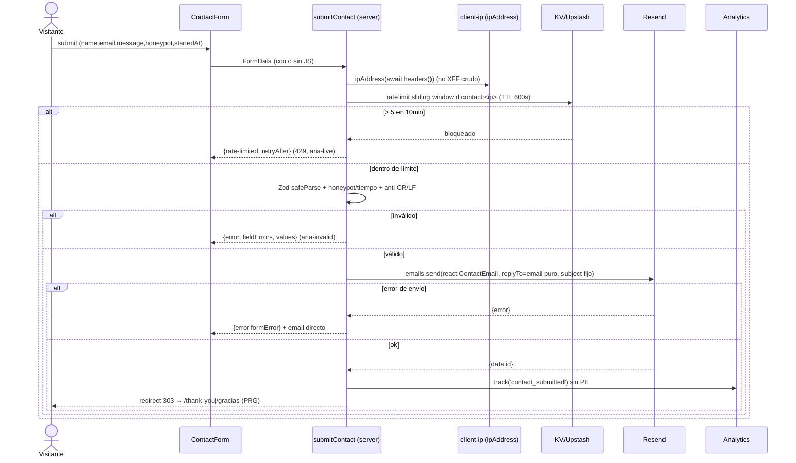

# Arquitectura — Portafolio Johan Rodriguez (diagrama fuente)

Fuente versionable de los diagramas del diseño. Detalle completo en `specs/design.md` (privado, en .gitignore).

> Correcciones de la revisión adversarial reflejadas: nonce que llega al RSC (mutación in-situ de `request.headers` en `proxy.ts`), `<html>` único en `[locale]/layout` (raíz passthrough), `proxy.ts` en **Node.js runtime** (no edge), IP de confianza vía `@vercel/functions`, MDX compilado en servidor, `PerformanceMonitor` + try/catch del loop + listeners de contexto.

## Componentes / arquitectura



## Secuencia — Server Action de contacto



## Carga del Hero 3D con fallbacks

```mermaid
flowchart TD
  Start([Render home dinámico-SSR]) --> Text["Texto hero SSR (LCP) + HeroPoster background-image (no LCP)"]
  Text --> RM{prefers-reduced-motion? (gate cliente)}
  RM -- sí --> Poster["HeroPoster (sin Canvas)"]
  RM -- no --> GPU{WebGL ok && GPU tier>1? (detect-gpu dinámico)}
  GPU -- no --> Poster
  GPU -- sí --> IO{Hero en viewport?}
  IO -- no --> Wait["IntersectionObserver"] --> IO
  IO -- sí --> Load["dynamic import Scene (ssr:false, ≤160KB)"]
  Load --> Canvas["Canvas frameloop=demand · performance.min · instancing"]
  Canvas --> Run{Evento runtime}
  Run -- contextlost --> EB["listeners gl.domElement → HeroPoster"]
  Run -- error montaje/render --> EB2["WebGLBoundary → HeroPoster"]
  Run -- throw en useFrame --> EB3["try/catch en loop → eleva estado → HeroPoster"]
  Run -- fuera de viewport --> Pause["setFrameloop('never')"] --> IO
  Run -- FPS sostenido bajo --> PM["PerformanceMonitor onFallback → desmonta Canvas"] --> Poster
```
